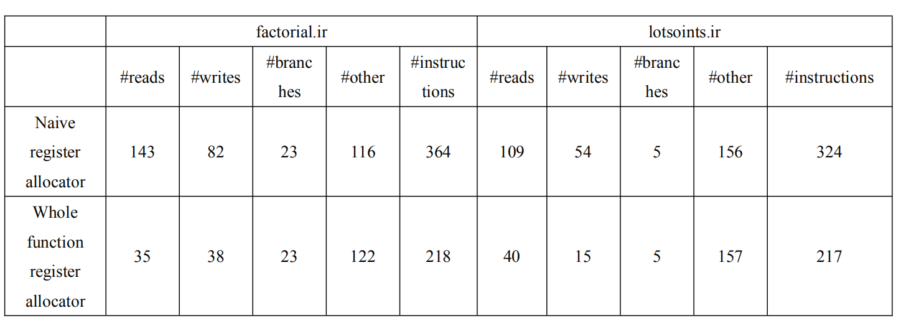

# CS 8803-008: Tiger Compiler Backend

## Design internals
In naïve register allocator, there’s no analysis at all. For each instruction, registers are allocated to its operands. Then after it is executed, its result is stored back into memory and the allocated registers are released.

In whole function register allocator, liveness analysis is done for all variables in each function with the following equations


Live range and interference graph for variables are built based on liveness analysis. Then register allocation is performed using Briggs’ optimistic coloring algorithm[1]:

While G cannot be R-colored  
&emsp;While graph G has a node N with degree less than R  
&emsp;&emsp;Remove N and its associated edges from G and push N on a stack S  
&emsp;End While   
&emsp;If the entire graph has been removed then the graph is R-colorable   
&emsp;&emsp;While stack S contains a node N   
&emsp;&emsp;&emsp;Add N to graph G and assign it a color from the R colors   
&emsp;&emsp;End While   
&emsp;Else graph G cannot be colored with R colors   
&emsp;&emsp;Simplify the graph G by choosing an object to spill and remove its node N from G   
&emsp;&emsp;(spill nodes are chosen based on object’s number of definitions and references)   
End While   


Both allocators support IR for Tiger Language, including assign, add/sub/mult/div/and/or, goto, breq/brneq/brlt/brgt/brgeq/brleq, return, call/callr, array_store/array_load/assign(array assignment)

Both allocators also supports operations on int and float type variables.

In instruction selection and code generation, we use one to one match method to generate one or more assembly codes for each IR code. It is very straightforward to find corresponding MIPS code for memory, control, arithmetic IR code. 

One difficulty is to do function call, in our design, we record the total space, including the space of local variables, outscope variables and return address for every function. When meeting call/callr instruction, we reduce the $sp by the amount of space size of callee function in caller function, which means we allocate space for callee function, and store needed variable into that area. When meeting return, we add the $sp and deallocate the space. To ensure the correctness of program and avoid reusing the same register, we store all variables that reside in registers back to memory before function call and load them back after finishing function call. 


## How to Build:
By running **make** on Ubuntu, the executable file tiger will be generated in current directory.

## How to Run:
Our executable program has three parameters
-f, input the name of ir file <br/> 
-o, type ‘u’ means choosing the unoptimized naive register allocator; type ‘o’ means choosing the optimized whole function register allocator. <br/> 
-h, print the help information <br/> 
For example: <br/> 
`./tiger -f factorial.ir -o u` <br/> 
means we use factorial.ir as input to our compiler and choose naive register allocator <br/> 
`./tiger -h`  <br/> 
will output help information, <br/> 
```
#define USAGE                <br/> 
"usage:\n"                    <br/> 
"  tiger [options]\n"       <br/> 
"options:\n"                    <br/> 
"  -f [ir_file]  ir file to generate MIPS code\n"     <br/> 
"  -o [reg_allocator]  'o' means optimized register allocation, 'u' means unoptimized\n"     <br/> 
"  -h              Show this help message\n" <br/> 
```

The compiler will generate a file named MIPSCode.s which contains assembly code of the input ir file. MIPSCode.s can load and execute on the supplied SPIM simulator. <br/> 

The next section shows the detailed code quality generated by our compiler. <br/> 


## Code quality comparisons



We did tests on two provided ir files: factorial.ir and lotsoints.ir. For each ir testing file, the output result of two register allocators matches, and whole function register allocator greatly reduce the number of reads and writes instructions. You can use the provided .s files (naivelotsoints.s, optlotsoints.s, naivefactorial.s, optfactorial.s) to reproduce these results. 


## Reference:
[1] https://courses.cs.washington.edu/courses/csep521/07wi/prj/pardoe.docx
